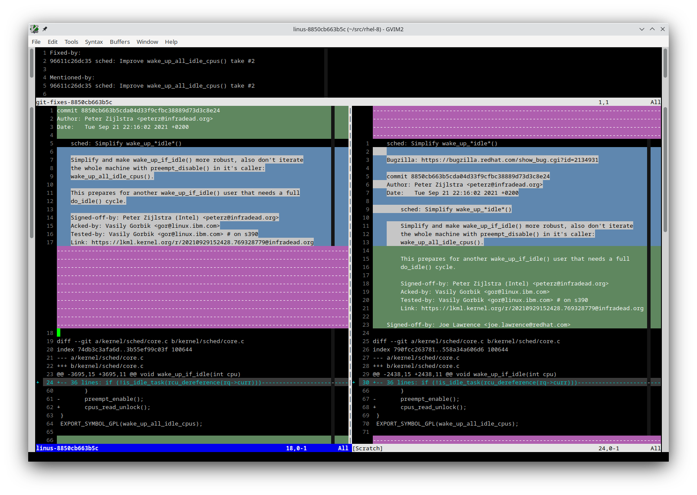

# kreview-vim-plugin



## Installation

Put `kreview.vim` in ~/.vim/plugin directory.

## Usage

Feed vim a downstream patch from git / mutt / etc:
```
(rhel-8.git) $ git show 90507d2092f7 | gvim -geometry 180x50 -c "call AutoLinuxDiff()" -
```

## Vim functions

* GitFixes(), command GF
* LinuxCommitDiff(), command LCD - find upstream commit hash in current
  buffer and automatically run LinuxCommitDiff

* LinuxCommitTab(), command LCT - open upstream git commit in a new tab

* LinusFileDiff(), command LFD - split window diff of currently open
  downstream file with upstream counterpart

* LinusFileTab(), command LFT - open upstream counterpart of currently
  open downstream file in a new tab
